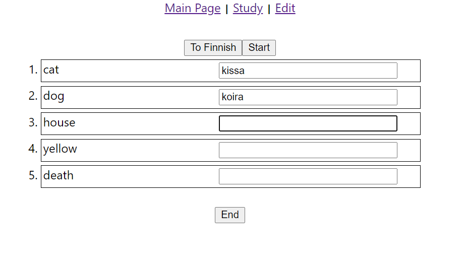

# Language Trainer

**This project was done for backend NodeJS-course in TAMK (Tampere University of Applied Sciences).**

Link to the project review video: [project review]()

Language Trainer is a web-application where users can practice their vocabulary between languages: Finnish and English.  There are three(3) views/pages at the website:  

1. User writes down corresponding words in selected language and after that gets a score on how many and which words were correct.
2. User can study vocabulary.
3. User can add, edit or delete words. (Could be implemented that this page would be only awailable to users with clearance.)

## Tecnologies used

- Frontend: React  
- Backend: Express/NodeJS  
- Database: SQL  
 
Icons are from MUI material-icons.

## Screenshots

Main page, from English to Finnish: 
 
Main page, from English to Finnish completed: 
 
Main page, from Finnish to English: 
 
Study page: 
 
Edit page: 
 
Edit page, adding new word pair, syntax error on other input: 
